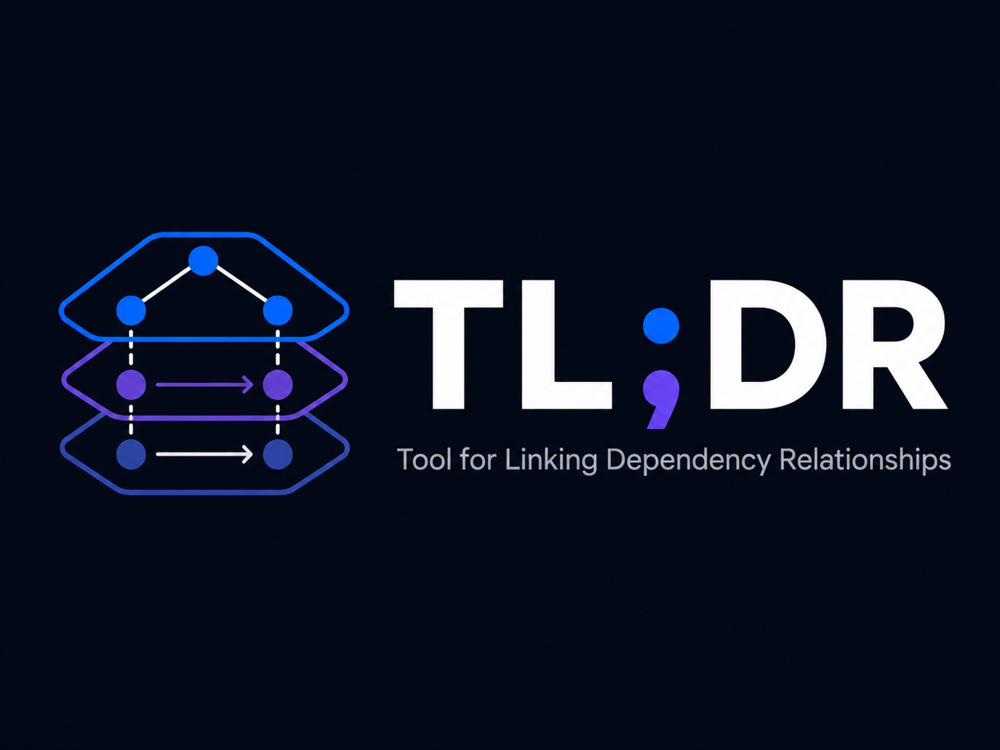

# TL;DR — Tool for Linking Dependency Relationships

[](https://github.com/tcamise-gpsw/tldr-diagram/actions/workflows/ci.yml)
[](https://pypi.org/project/tldr-diagram/)
[](https://tcamise-gpsw.github.io/tldr-diagram/)
[](https://www.python.org/)
[](frontend/)
[](LICENSE)

Architecture diagram generator that analyzes source code with [tree-sitter](https://tree-sitter.github.io/), classifies elements into architectural groups, and produces interactive navigable diagrams in the browser.



## How It Works

```
Source code (.kt files)
    │
    ▼
tree-sitter analysis ──→ classes, interfaces, imports, type references
    │
    ▼
classifier ──→ routes elements to groups via rules in groups.yaml
    │
    ▼
auto-splitter ──→ breaks oversized groups into sub-groups
    │
    ▼
connector processing ──→ dedup, remap nested classes, scope to views
    │
    ▼
aggregation ──→ summary edges at every ancestor level (LCA-based)
    │
    ▼
elements.yaml + connectors.yaml
    │
    ▼
React viewer ──→ dagre layout → canvas rendering → interactive diagram
```

## Quick Start

### Prerequisites

- Python >= 3.11
- [pipx](https://pipx.pypa.io/) — `brew install pipx` or `pip install --user pipx`

### Install and Run

```bash
# Analyze your Kotlin sources (requires a groups.yaml in the workspace)
pipx run --spec tldr-diagram tldr analyze \
  --source-root /path/to/kotlin/sources \
  --input-dir /path/to/workspace \
  --repo-root /path/to/repo

# View the diagram
pipx run --spec tldr-diagram tldr serve \
  --workspace /path/to/workspace
```

Opens at `http://127.0.0.1:8060/views`. The package includes a pre-built frontend — no Node.js or frontend build step required.

## Configuration

The tool is configured via a `groups.yaml` file in the workspace directory. This file defines:

- **Modules** — top-level containers (e.g., `api`, `core`, `domain`)
- **Groups** — architecture components, nested under modules or other groups
- **Rules** — package prefix routing: `(module, prefix) → group`
- **Settings** — `source_prefix`, `package_marker`, `max_group_size`

### Example `groups.yaml`

```yaml
modules:
  api:
    name: API
    description: Use case layer.
  core:
    name: Core
    description: SDK implementation.
  domain:
    name: Domain
    description: Domain models and contracts.

groups:
  core-network:
    name: Network
    description: Transport layer.
    parent: core
  core-settings:
    name: Settings
    description: Setting resolution and data sources.
    parent: core

rules:
  - module: my-sdk-core
    prefix: core/network
    group: core-network
  - module: my-sdk-core
    prefix: core/domain/setting
    group: core-settings
  - module: my-sdk-core
    prefix: core
    group: core-infra   # catch-all for unmatched core classes

settings:
  max_group_size: 20
  source_prefix: "sdk/"                        # stripped from file paths to find module name
  package_marker: "/com/example/myproject/"     # marks where architecture-relevant packages start
```

### Settings Reference

| Key | Default | Description |
|-----|---------|-------------|
| `source_prefix` | `""` | Path prefix stripped from file paths to reach the module directory |
| `package_marker` | `""` | Sub-path marker that delimits the architecture-relevant package hierarchy |
| `max_group_size` | `20` | Groups with more elements than this are auto-split by next package segment. Set to `0` to disable. |

## CLI Reference

### `tldr analyze`

```
tldr analyze --source-root <path> [options]
```

| Flag | Description |
|------|-------------|
| `--source-root` | **(required)** Directory containing source files |
| `--input-dir` | Directory with `groups.yaml` (default: cwd) |
| `--output-dir` | Where to write YAML (default: input-dir) |
| `--repo-root` | Repository root for relative paths (auto-detected via `.git`) |
| `--max-group-size N` | Override auto-split threshold |
| `--all-classes` | Keep all classes, even those without connectors |
| `--dry-run` | Print stats without writing files |

### `tldr serve`

```
tldr serve --workspace <path> [options]
```

| Flag | Description |
|------|-------------|
| `--workspace` | **(required)** Directory with `elements.yaml` and `connectors.yaml` |
| `--frontend-dist` | Path to built `frontend/dist/` (default: bundled frontend from PyPI package) |
| `--port` | HTTP port (default: 8060) |
| `--no-open` | Don't open browser automatically |

## Frontend Viewer

The viewer is a React + TypeScript SPA that renders architecture diagrams on a canvas:

- **Navigable views** — click group nodes to drill in, breadcrumb to navigate up, browser back button works
- **Pan and zoom** — mouse drag to pan, scroll to zoom
- **Selection** — click a node to see its connectors in the side panel and open a cross-hierarchy neighborhood of directly connected components
- **Component neighborhoods** — focused views show the selected component, all direct neighbors, and every interconnection among those displayed components
- **External stubs** — dashed rays show connections outside the current view; click an aggregated stub to expand its individual targets
- **Collapsible side panel** — sortable connector table with direction, target, module, relationship, view columns
- **Transition animations** — smooth camera transitions when drilling in/out

### Development

```bash
cd frontend
npm run dev          # Vite dev server on :5173
npm test             # Vitest unit tests
npm run test:watch   # Vitest in watch mode
```

The `public/` directory contains sample `elements.yaml` and `connectors.yaml` for development.

## Using from Another Repository

Your project only needs two things:

1. **`groups.yaml`** — routing rules specific to your codebase (modules, groups, package rules)
2. A shell script that runs `tldr analyze` then `tldr serve` via `pipx`

Example script:

```bash
#!/bin/bash
set -e
SCRIPT_DIR="$(cd "$(dirname "${BASH_SOURCE[0]}")" && pwd)"
REPO_ROOT="$(cd "$SCRIPT_DIR/../.." && pwd)"

pipx run --spec tldr-diagram tldr analyze \
  --input-dir "$SCRIPT_DIR" \
  --source-root "$REPO_ROOT/src" \
  --repo-root "$REPO_ROOT"

pipx run --spec tldr-diagram tldr serve \
  --workspace "$SCRIPT_DIR"
```

No cloning, no Node.js, no frontend build — the PyPI package includes the pre-built frontend.

## Project Structure

```
tldr-diagram/
├── src/tldr/                  # Python package
│   ├── __main__.py            # CLI (analyze + serve subcommands)
│   ├── pipeline.py            # Orchestration
│   ├── models.py              # Dataclasses (ArchTree, Element, Connector, etc.)
│   ├── config.py              # groups.yaml loader + validation
│   ├── kotlin_analyzer.py     # Tree-sitter Kotlin parser
│   ├── classifier.py          # Config-driven element routing
│   ├── splitting.py           # Auto-split oversized groups
│   ├── connectors.py          # Dedup, remap, scope connectors
│   ├── aggregation.py         # LCA-based connector rollup
│   └── server.py              # HTTP server for viewer
├── tests/                     # Python tests (pytest, 75 tests)
├── frontend/                  # React + TypeScript viewer
│   ├── src/
│   │   ├── App.tsx            # Root component
│   │   ├── data/              # YAML loading, types
│   │   ├── canvas/            # Rendering, layout, camera, hit-test
│   │   └── components/        # SidePanel, Toolbar, Tooltip
│   └── tests/                 # Playwright E2E tests
└── pyproject.toml             # Package config (hatchling)
```

## Language Support

Currently supports **Kotlin** via `tree-sitter-kotlin`. The analyzer (`kotlin_analyzer.py`) is the only language-specific module. Everything downstream — classifier, splitter, connectors, aggregation, serialization, frontend — is language-agnostic.

To add a new language, write an analyzer module that produces an `AnalysisResult`:
- `raw_elements`: `dict[str, dict]` keyed by `"file_path::ClassName"`
- `raw_connectors`: `list[dict]` with `source`, `target`, `relationship`

## Acknowledgments

TL;DR started as a fork of [tld](https://github.com/Mertcikla/tld) by Mert Cikla — a Go-based architecture diagramming tool inspired by the C4 model. The original tool's concepts of hierarchical elements, connectors, and navigable views directly informed TL;DR's data model and viewer design.

TL;DR diverges from the original by replacing Go with a Python analysis pipeline using tree-sitter for automated source code discovery, and by rewriting the frontend as a canvas-based React viewer with drill-down navigation.

## License

MIT
